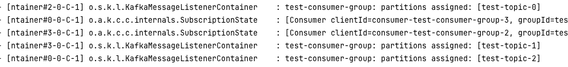
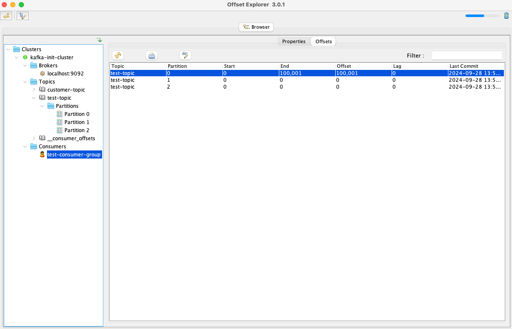
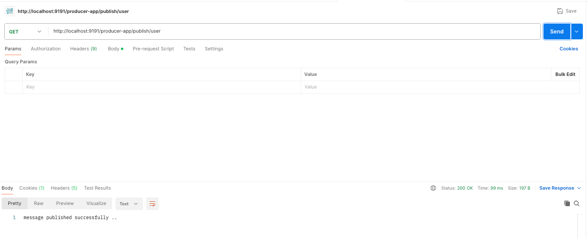
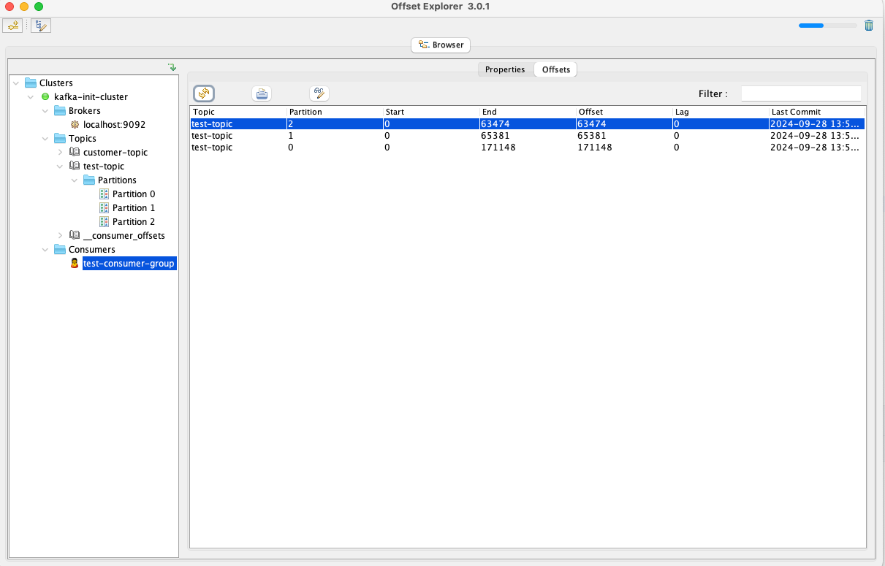

# kafka-consumer-example

# Consumer group and assigned partition

# Offset explorer 
After the consumer application runs, we can see the consumer offset and consumer group details

# Postman output

# Offset explorer output after executing or publishing the messages
